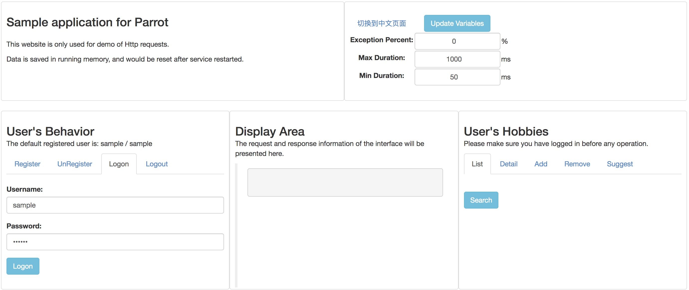

# Parrot Sample
**This project is mainly used for sampling and demonstration of interface automation.**

* Currently it only provides HTTP interface operations, including GET and POST methods, involving headers and cookies operations.
* To be lightweight, all data is stored in the running memory and will be reset after restarting the service.
* Code repository: <https://github.com/idle-man/ParrotSample>, welcome your code and issues.

## Deployment
### Step 0: Basic environment preparation
* Use the `git clone` or `Download ZIP` method to pull the project source code to the machine to be deployed.
* This project is based on python 3, the recommended version is  3.7.x, please ensure that `python` and `pip` are installed on the machine running this service.
* The modules that this project depends on have been written in requirements.txt and can be installed using `pip install -r requirements.txt`.

### Step 1: Launch the application
This project starts by command line: `python app.py`

* Port 8080 is used as default. If there is a conflict, you can modify the `_PORT_` value in app.py.
* For debugging, add the parameter `debug=True` in `app.run`.
* To run in the background, you can start it using `python app.py &`.

If it starts normally, you could see `http://0.0.0.0:8080/` on the screen output.

Otherwise, please confirm Step 0 and port usage. If you have any questions, please feedback an issue.

### Step 2: Visit the application
This project is mainly accessed through a browser.

* The server ip can be obtained by `ipconfig` or `ifconfig` command, and then spliced ​​into a complete address, such as: `10.100.100.10:8080`, 127.0.0.1 is not recommended.
* The above address can be directly accessed in the browser window. If it is normal, the page function module will be presented.
* This site is not compatible with mobile styles, and the mobile display is not effective.

If the access is abnormal, please make sure that the application of Step 1 is running normally, and then there is a problem to feedback an issue.

## Functional operations
**Page View Example:**

**General functions**

* Interface requests are in HTTP GET and POST methods, and the response text is in json format.
* The headers and cookies of each request contain the token of the current login state.
* The response information of each request contains the current `timestamp` and randomly generated `tag`.

***
### Configuration Area
**Function 1: Chinese and English page switching**

**Function 2: Running configuration changes**

* **Exception Percent**: Random exception ratio for all requests, default is 0
* **Max/Min Duration**: Time-consuming random intervals for all requests in ms(micro-second)
* The variables are stored in the running memory. After the above configuration is updated, it will take effect immediately and will be reset after application restart.

***
### Display Area
Request and response information for all requests are presented in this area for intuitive view.

* For more detailed information, it is recommended to use the browser developer tool(F12) to view on the `Network` channel.

***
### User's Behaviors
This project provides a sample/sample account by default.

**Register**

* POST method
* The newly registered user information will be saved in the running memory and will be cleared after restarting the application.

**UnRegister**

* POST method
* Need user to operate in login state
* The current user will be logged out and the cookie will be cleared, also cleared from the running memory, and will be reset after restart.

**Logon**

* POST method
* A random `token` will be generated, which is reflected in the response header and the cookie. It's the value of `token` in the headers of other requests.

**Logout**

* POST method
* The current user will be logged out and the cookie will be cleared. The original `token` will be invalid.

***
### User's Hobbies
**List**

* GET method
* Need user to operate in login state
* The sample user has two default hobbies, which can be added, removed, and will be reset after restart.

**Detail**

* GET method
* Need user to operate in login state
* The `name` in the parameters needs to be a valid value in the hobby `list`.

**Add**

* POST method
* Need user to operate in login state
* The new hobby is also stored in the running memory and will be reset after restart.

**Remove**

* POST method
* Need user to operate in login state
* If the sample user's default hobby is deleted, it can be reset after the application is restarted.

**Suggest**

* GET method
* Need user to operate in login state
* The parameter includes the `today` date, and the recommended hobby is a random selection.

## Demo Suggestion
**Recommended functions operating link:**

Logon => Hobby List => Add a Hobby => Hobby List => Hobby Detail => Hobby Suggestion => Logout

The developer tool (F12) of the browser can be opened in advance, the corresponding request call list can be viewed in the `Network` channel, and the **HAR** file can also be exported using `Save all as HAR with content`.

> HAR (HTTP Archive Resource) is a common standardized format for storing HTTP requests and responses.
> 
> Its versatility: can be exported in consistent format, in Charles, Fiddler, Chrome, etc.
> 
> Its standardization: JSON format and UTF-8 coding.

