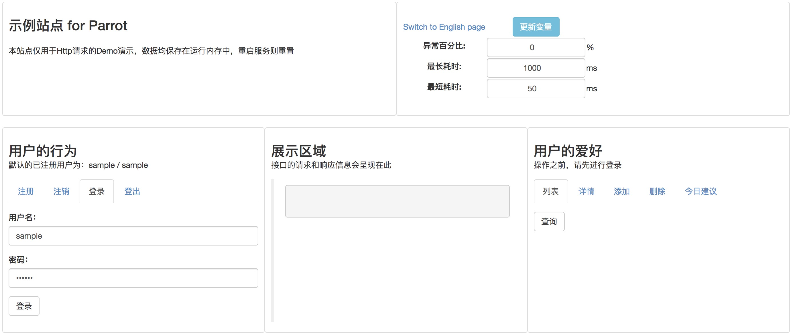

# Parrot Sample - 示例项目
**本项目主要用于接口自动化的采样、演练和演示**

* 目前仅提供HTTP协议的接口操作，包含GET和POST方法，涉及headers和cookies操作
* 为了轻便，所有的数据都存储在运行内存中，重启服务后会被重置
* 代码仓库：<https://github.com/idle-man/ParrotSample>，欢迎共建或反馈Issue

## 安装部署
### Step 0: 基础环境准备
* 使用`git clone`或`Download ZIP`的方式将本项目源码拉取到要部署的机器上
* 本项目基于python 3开发，推荐版本：3.7.x，请确保运行本服务的机器上已安装python及pip
* 本项目依赖的module已写入requirements.txt中，可使用`pip install -r requirements.txt`进行安装

### Step 1: 启动应用
本项目采用命令行方式启动: `python app.py`

* 默认使用8080端口，如有冲突，可自行修改app.py中的`_PORT_`值
* 如需调试，可在app.py的`app.run`中增加`debug=True`的参数
* 如需后台运行，可采用`python app.py &`的方式启动

如正常启动，屏幕可见`Running on http://0.0.0.0:8080/` 内容输出

如未正常启动，请确认Step 0和端口使用情况，再有问题可反馈Issue

### Step 2: 操作应用
本项目主要通过浏览器访问

* 可通过`ipconfig` 或 `ifconfig` 获取服务器ip，之后拼接成完整的地址，如：`http://10.100.100.10:8080`，不建议使用127.0.0.1
* 上述地址可在浏览器窗口直接访问，正常的话会呈现页面功能模块，可点击操作
* 本站点未兼容移动端样式，移动端显示效果不佳

如访问异常，请确保Step 1的命令行应用正常运行中，再有问题可反馈Issue

## 功能操作
**页面示例：**

**通用功能**

* 接口请求均为HTTP GET和POST方法，响应文本均为json格式
* 各接口的请求headers和cookies中包含当前登录态的token
* 各接口响应信息中包含当前的timestamp和随机生成的tag

***
### 配置区
**功能一：中英文页面切换**

**功能二：运行配置变更**

* **Exception Percent(异常百分比)**：可配置所有接口的随机异常比例，默认为0
* **Max/Min Duration(最长/最短耗时)**：可配置所有接口的耗时随机区间，单位为ms(毫秒)
* 因变量存储于运行内存中，以上配置更新后，**即刻生效**，重启应用后会被重置

***
### 展示区
所有接口的请求和响应信息会在该区域展现，用于直观的查看

* 更详细的信息，推荐采用浏览器的开发者工具(F12)，在`Network`频道查看

***
### 用户的行为
本项目默认提供一个sample/sample账户

**用户注册(Register)**

* POST方法
* 新注册用户信息会保存在运行内存中，重启应用后失效

**用户注销(UnRegister)**

* POST方法
* 需要用户在登录状态下操作
* 会将当前用户登出并清除cookie，同时从运行内存中清除，重启应用后会重置

**用户登录(Logon)**

* POST方法
* 会生成随机`token`，体现在response header和cookie中，其它接口的headers传参中的token均采用此值

**用户登出(Logout)**

* POST方法
* 会将当前用户登出并清除cookie，原有`token`失效

***
### 用户的爱好
**爱好列表(List)**

* GET方法
* 需要用户在登录状态下操作
* sample用户下有两个默认的爱好，可进行新增、删除，重启应用会被重置

**爱好详情(Detail)**

* GET方法
* 需要用户在登录状态下操作
* 传参中的`name`需要是`爱好列表`中的有效值

**爱好新增(Add)**

* POST方法
* 需要用户在登录状态下操作
* 新增的爱好同样存储于运行内存中，重启应用后会被重置

**爱好删除(Remove)**

* POST方法
* 需要用户在登录状态下操作
* sample用户默认的爱好被删除的话，可在应用重启后被重置

**爱好推荐(Suggest)**

* GET方法
* 需要用户在登录状态下操作
* 传参中包含`today`日期，推荐的爱好为随机选取

## 演示建议
**推荐的功能操作链路：**

登录 => 爱好列表 => 添加爱好 => 爱好列表 => 爱好详情 => 今日推荐 => 登出

可提前打开浏览器的开发者工具(F12)，在`Network`中查看到相应的接口调用列表，也可以导出**HAR**文件：`Save all as HAR with content`

> HAR（HTTP Archive Resource）文件为储存HTTP请求和响应的通用标准化格式
>
>  - 其通用性体现在：Charles、Fiddler、Chrome等均可导出且格式一致
>
>  - 其标准化体现在：JSON格式和UTF-8统一编码

